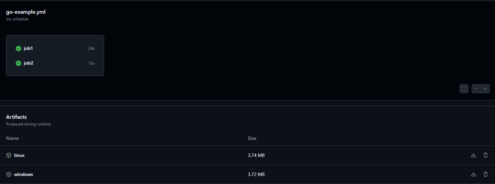

# Aula 05 - Artifact



> Este repositório trata-se do trabalho de conclusão da matéria de CI/CD - Continuos Integrations/Continuos Delivery do curso MBA Cloud Computing & DevOps da Impacta.

## 🚀 Desafio Proposto

Criar um scheduler de execução do evento push presente no arquivo, que seja trigado a cada 15 min, de segunda à sábado:

```
 schedule:
    - cron: '*/15 * * * 1-6'
```

Acrescentar dois novos jobs no workflow existente (go-example.yml), com a dependência de execução e conclusão do job criado no exercício da aula (identificador build-go). Além disso, os jobs devem ter as seguintes características.

1º JOB

- Identificador: download-and-run-linux
- Name: Download and run Linux
- Runner: ubuntu (última versão)
- Primeiro Step: usar a action de checkout no repo
- Segundo Step: usar a action de download do artefato, passando como argumento o nome do artefato chamado linux, gerado durante o exercício
- Terceiro Step: executar no S.O o comando para ler as opções do script run.sh (comando: source ./run.sh)

```
jobs:
  job1:
    runs-on: ubuntu-latest
    steps:
      # Copy the code of repository and prepare to use on Ubuntu
      - name: Get Code
        uses: actions/checkout@v4.1.7

      # Create a build of Go example on Ubuntu
      - name: Build ${{ env.FILE_NAME }} for ubuntu-latest
        run: go build ${{ env.FILE_NAME }}.go

      # Upload the artifact for Linux
      - name: Upload artifact for linux
        uses: actions/upload-artifact@v4.4.0
        with:
          name: linux
          path: ./${{ env.FILE_NAME }}

      # Download the artifact for Linux
      - name: Download artifact for Linux
        uses: actions/download-artifact@v4.1.8
        with:
          name: linux
          path: ./

      # Execute Run Script
      - name: download-and-run-linux
        run: |
          chmod +x ./run.sh
          ./run.sh
```

2º JOB

- Identificador: download-only-windows
- Name: Download Windows
- Runner: windows (última versão)
- Primeiro Step: usar a action de checkout no repo
- Segundo Step: usar a action de download do artefato, passando como argumento o nome do artefato chamado windows, gerado durante o exercício

```
 job2:
    runs-on: ubuntu-latest
    steps:
      # Copy the code of repository and prepare to use on Ubuntu
      - name: Get Code
        uses: actions/checkout@v4.1.7
      # Create a build of Go example on Windows
      - name: Build ${{ env.FILE_NAME }} for Windows
        run: GOOS=windows GOARCH=amd64 go build ${{ env.FILE_NAME }}.go

      # Upload the artifact for Windows
      - name: Upload artifact for windows
        uses: actions/upload-artifact@v4.4.0
        with:
          name: windows
          path: ./${{ env.FILE_NAME }}.exe

    # Download the artifact for Windows
      - name: Download artifact for Windows
        uses: actions/download-artifact@v4.1.8
        with:
          name: windows
          path: ./
```
